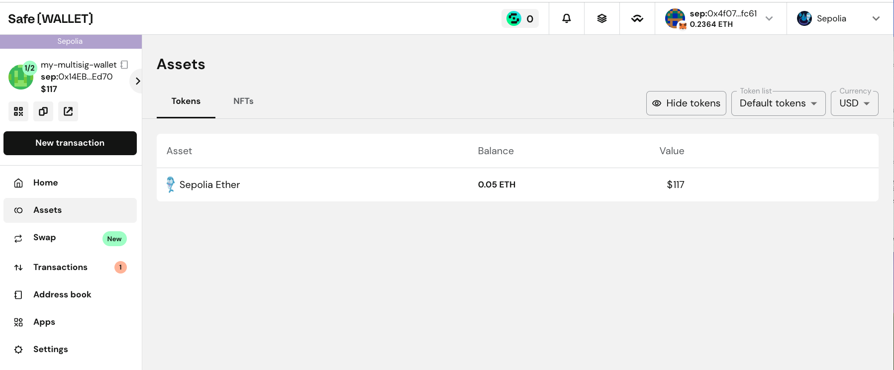

## 引言

在区块链世界中，安全始终是一个关键话题。随着加密资产价值的增长，如何安全管理这些资产变得越来越重要。多签钱包作为一种增强资产安全的有效工具，逐渐受到市场的广泛认可。[Safe 多签钱包](https://safe.global/wallet)（前身为 Gnosis Safe）便是其中的佼佼者，它不仅适用于以太坊和其他 EVM 兼容的区块链，还支持执行复杂的交易操作。

多签钱包的核心理念是将私钥的控制权分散到多个参与者手中，通过要求多个签名来授权交易，从而提高资金的安全性。Safe 在这一基础上，通过以太坊的智能合约技术，提供了一个安全可靠且功能丰富的多签钱包解决方案，这种解决方案不仅保障了资金的安全，还提供了灵活的操作性，满足了不同用户的多样化需求。

## 多重签名交易流程

Safe 多签钱包采用了一种称为“n-of-m”（其中 n 是 m 的子集）的多重签名机制。该机制要求在 m 个钱包所有者中有至少 n 个所有者签名，才能执行交易。

多重签名的交易流程如下：

1. 交易提议：任一所有者均可发起交易提议。
2. 签名收集：其他所有者对交易进行离线签名。
3. 交易执行：一旦收集到足够的签名并达到预设的签名阈值，任何人都可以执行该交易。

这种机制不仅确保了交易的安全性，还提供了灵活性，允许用户根据自身需求设定不同的签名门槛。

例如：设置为 2-of-3 的 Safe 钱包由三个账户共同拥有，需要至少两个账户的签名才能执行交易。

假设 Alice、Bob 和 Charlie 是该钱包的共有者。Alice 提出向另一地址转账 1 ETH 的提案，并已完成自己的签名。Bob 或 Charlie 在审查提案无误后，可以添加他的签名。一旦签名达到所需数量，任何人均可执行该交易，但执行该交易的人需要支付 gas 费用。

## Safe 多签钱包的技术架构

Safe 多签钱包的核心是一系列智能合约，主要包括(v1.3.0)：

1. **主合约（GnosisSafe）**：负责管理钱包的核心逻辑，包括所有者管理、交易执行等。
2. **代理合约（GnosisSafeProxy）**：每个 Safe 钱包实例都是一个代理合约，指向主合约的实现。
3. **模块管理（ModuleManager）**：可插拔的功能扩展，如社交恢复等。
4. **防护模块（GuardManager）**：用于增加额外的安全检查（制定特定地址才能执行、重入保护、允许/禁止 delegatecall 特定地址等）。

## 功能特色

### 直观和友好的用户界面
用户可以方便地在其[官网](https://app.safe.global/welcome/accounts)上创建多签钱包、查看钱包资产、发起多签交易。

### 支持多个区块链网络

Safe 支持多个主流区块链网络，包括但不限于：

- Ethereum
- Polygon
- BNB Chain
- Gnosis Chain
- Arbitrum
- Optimism

这种多链支持使得用户可以在不同网络间管理资产，提高了资产管理的灵活性。

### 资产管理能力

Safe 不仅支持原生代币（如 ETH），还支持各种 ERC20 代币和 ERC721 NFT。用户可以在 Safe 钱包界面直接查看和管理这些资产。

### 与 DeFi 协议的集成

Safe 提供了与多个 DeFi 协议的原生集成，例如：

- Uniswap：直接在 Safe 界面进行代币交换。
- Aave：管理借贷头寸。

这些集成大大提高了资金使用的效率和便利性。

## 使用场景

### 企业资金管理

对于企业来说，Safe 提供了一个理想的资金管理解决方案：

- 多人授权：防止单点故障和内部欺诈。
- 交易透明：所有交易都可以在链上追踪和审计。
- 灵活控制：可以为不同级别的支出设置不同的审批流程。

### DAO 治理

在去中心化自治组织（DAO）中，Safe 可以作为国库管理工具：

- 提案执行：通过多签机制执行已通过的提案。
- 资金分配：根据社区决策管理和分配资金。
- 权限管理：可以为不同的工作组设置不同的权限。

### 个人资产保护

对于持有大量加密资产的个人，Safe 提供了额外的安全层：

- 防止私钥丢失：即使丢失一个私钥，也不会影响资金安全。
- 继承计划：可以设置时间锁和继承人，确保资产可以被合法继承。
- 分散风险：可以将资产分散到多个设备或地理位置。

## 结语
区块链世界中，资产安全是用户首要关注的问题。Safe 多签钱包依托智能合约和多签机制，提供安全和灵活的资产管理方案，支持多个主流区块链网络并与多种 DeFi 协议集成。尽管 Safe 具有诸多优点，用户应基于自己的需求和安全考量，仔细评估选择合适的多签钱包解决方案。