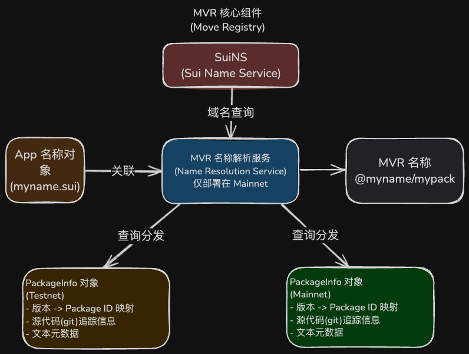

# MVR（Move Registry）：Move 注册表

当前区块链生态系统中，智能合约的地址往往是一串难以记忆的随机字符，这给开发者和用户带来了不少困扰。

MVR（Move Registry，发音为"mover"）旨在解决这个问题，为 Sui 区块链上的智能合约包提供统一的命名服务。

## 什么是 MVR？

MVR 是一个为 Sui 生态系统中 Move 语言包（packages）提供统一命名服务的工具。通过 MVR，开发者可以使用人类可读的名称来引用和构建智能合约，无需关心不同网络上的包地址。

## MVR 的主要功能

- **名称引用**：在可编程交易块（PTB）中通过名称引用包和类型
- **依赖管理**：在开发 Move 合约时，可以通过名称引用其他包作为依赖
- **版本管理**：可以引用特定版本的包，或默认使用最新版本

## MVR 的设计原理

MVR 由两个独立的核心部分组成：

1. **PackageInfo 注册系统**：在各网络上分别部署，负责存储包的元数据信息。其核心是 `PackageInfo` 对象。
2. **MVR 名称解析服务**：部署在主网上作为统一的真实数据源，处理名称解析请求，并将 MVR 名称链接到各网络上的 `PackageInfo` 对象。



下面将更详细地阐述这两个组件。

### PackageInfo 对象与注册系统

`PackageInfo` 对象是 MVR 的基础数据单元，部署在**每个需要发布包的网络**（主网、测试网、开发网等）上。开发者需要为自己的 Move 包，在其部署的**每一个网络上**，都创建一个对应的 `PackageInfo` 对象。

这个元数据对象主要包含以下信息和功能：

- **版本到地址映射**: 存储该包在该特定网络上的**版本号**与其**具体包地址 (Package ID)** 之间的映射关系。这是实现版本控制和名称解析的基础。
- **源代码追踪**: 记录不同版本的包源代码位置（例如 Git 代码仓库地址和特定的提交版本/hash），便于开发者和用户追溯、审计代码。
- **文本元数据**: 为包提供人类可读的元数据（如标题、描述、标签等），旨在供未来的 MVR 搜索引擎使用以方便发现和理解包的功能（当前版本此搜索功能未实现）。

可以认为，`PackageInfo` 对象是在**每个网络上**为同一个逻辑包（比如 "my-awesome-package"）维护的一个"本地记录簿"，详细记录了该包在该网络上不同版本的具体实现地址 (Package ID) 及相关元信息。

### MVR 名称解析服务 (主网)

为了将人类可读的 MVR 名称（如 `@myname/mypackage`）与不同网络上具体的 `PackageInfo` 对象关联起来，MVR 设计了一个**部署在主网 (Mainnet)** 上的名称解析服务。这个服务是**统一且权威的**。

其工作原理如下：

- **基于 SuiNS**: 该服务利用了 SuiNS (Sui Name Service)。一个 MVR 名称的域名部分（如 `@myname` 或 `myname.sui`）首先需要通过 SuiNS 解析，找到其在主网上关联的所有者地址或对象。
- **中央索引**: 与该 SuiNS 名称关联的数据（通常通过动态字段实现）存储着一个关键的**映射**：它将 **包名** (`mypackage`) 映射到该逻辑包在**各个网络** (主网、测试网等) 上对应的 **`PackageInfo` 对象** 的 **Object ID**。
- **查询路由**: 当工具（如 MVR CLI 或 SDK）需要解析 `@myname/mypackage` 在 `testnet` 上的地址时，它会先查询主网的解析服务。服务会返回 `mypackage` 在 `testnet` 上的 `PackageInfo` 对象的 ID。然后，工具再使用这个 ID 去查询 `testnet` 上的 `PackageInfo` 对象，最终获取到具体的包地址 (Package ID)。

因此，MVR 名称解析服务扮演着一个**中央目录或索引**的角色，它不直接存储包地址，而是将统一的 MVR 名称**路由**到各个网络上正确的 `PackageInfo` 数据记录。

### MVR 名称

MVR 名称由 SuiNS 名称和包名组成，格式为 `<suins_name>/<pkg_name>`。

例如，如果你的 SuiNS 名称是 `myname.sui`，你的包名是 `mypackage`，MVR 名称可以是 `@myname/mypackage` 或 `myname.sui/mypackage`。

MVR 标准还支持可选的 `/<version>` 格式，指定使用链上的哪个版本。例如：`@myname/mypackage/2` 表示使用第 2 版。

## MVR 工具链

### 1. MVR CLI

MVR 命令行工具允许开发者：

- 为 Move 项目添加依赖
- 使用 MVR 依赖构建 Move 项目

安装 MVR CLI 可以通过 Cargo、预编译二进制文件或源代码构建。

添加依赖简单示例：

```bash
mvr add <package_name> --network <mainnet|testnet>
```

### 2. TypeScript SDK 插件

MVR 为 Sui TypeScript SDK 提供了插件，使构建 PTB 时可以使用 MVR 名称，提供了无缝的开发体验。

使用前后对比：

**使用 MVR 前：**

```typescript
// 需要使用复杂的地址引用
transaction.moveCall({
    target: `0xe177697e191327901637f8d2c5ffbbde8b1aaac27ec1024c4b62d1ebd1cd7430::accessories::equip`,
    arguments: [...],
    typeArguments: [
        `0x80d7de9c4a56194087e0ba0bf59492aa8e6a5ee881606226930827085ddf2332::suifren::SuiFren`
    ]
});
```

**使用 MVR 后：**

```typescript
// 使用人类可读的名称引用
transaction.moveCall({
    target: `@suifrens/accessories::accessories::equip`,
    arguments: [...],
    typeArguments: [
        `@suifrens/core::suifren::SuiFren`
    ]
})
```

## 如何开始使用 MVR

1. **创建 PackageInfo 对象**：为你的包创建元数据对象
2. **设置应用程序元数据**：添加描述、图标、文档等信息
3. **关联包到应用程序**：将你的包与 MVR 名称关联
4. **使用工具链**：通过 CLI 和 SDK 插件开始享受 MVR 带来的便利

可以在线访问 [Move Registry](https://www.moveregistry.com/apps) 的前端页面，在页面上直接使用和管理 MVR 服务，无需命令行操作。

## 总结

MVR 通过提供统一的命名服务，简化了 Sui 区块链上 Move 智能合约的开发和使用流程。它让开发者能够使用人类可读的名称引用合约，管理依赖和版本，从而提高了开发效率和代码可读性。

## 参考

- [Move Registry 官网](https://www.moveregistry.com)
- [Move Registry 官方文档](https://docs.suins.io/move-registry)
